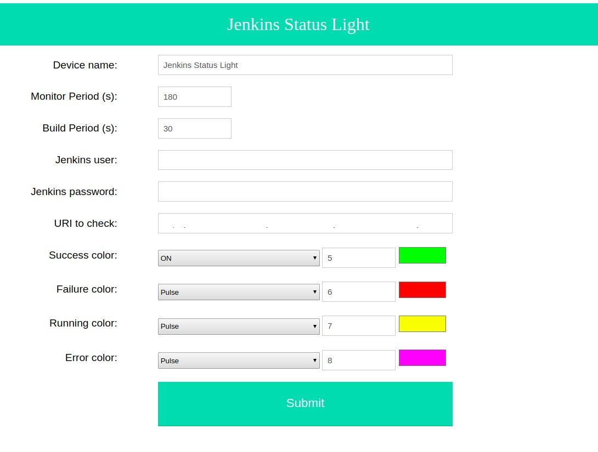
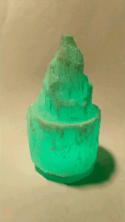
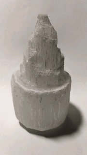
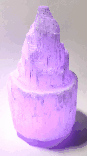
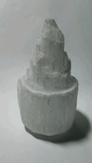
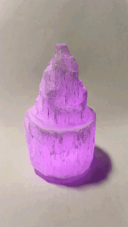
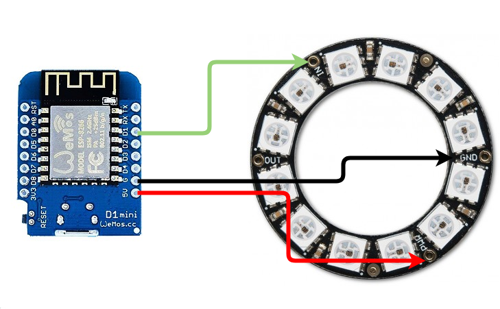

Jenkins Status Light
==================

## What is it?
It is a cute lamp that tells you how your project is doing with Jenkins. It runs on an ESP8266.

## Features
- Configurable through web interface.
- Fetchs and parses the information directly from Jenkins.
- Different colours and animations available.

## Usage

On first boot the device will create an access point for you to connect and configure the WIFI options. After this the device will reboot and connect to the selected WIFI network.

At this point you can configure the rest of the options by typing your device IP on your browser. The main fields to configure are:

- Device name.
- Monitor Period: Time in seconds between each check on Jenkins
- Build period: Time in seconds between each check on Jenkins during build. We usually want a shorter period to know as soon as possible when the Jenkins Pipeline finishes.
- Jenkins user.
- Jenkins password.
- URI to check: URI to the jenkins server and specific project/branch. Unfortunately at this moment the URI has to include the following ending to parse the data:
```
    /api/json?tree=building,result,url,culprits[absoluteUrl,fullName]
```
An URI example will then be:
```
`http://JENKINS-SERVER/job/PROJECT/job/master/lastBuild/api/json?tree=building,result,url,culprits[absoluteUrl,fullName]`
```

The device differentiates 4 different cases, wich are:
- Success: Jenkins Pipeline ended succesfully.
- Failure: Jenkins Pipeline failed.
- Running: Jenkins Pipeline running.
- Error: Device could not fetch the status of the Pipeline.

You can also configure the colour and animations for each of the states. The available animations are the following.

| ON | OFF | Flash | Pulse | Rainbow |
| --- | --- | --- | --- | --- |
|  ||  |  |  |

## Build your own
It is quite an easy process to make your own light.
### Hardware
Only two components are required. An ESP8266 and a bunch of WS2812 (Neopixel) LEDs.
It is recomended to use an ESP dev board such as the [Wemos D1 mini](https://wiki.wemos.cc/products:d1:d1_mini) because it includes the required USB to serial adapter to flash the device.
For the LEDs you can use as many or as few as you consider necessary. For the animation images in this README a single LED was used. But I personally like the combination of an [LED ring](https://es.aliexpress.com/item/32672949478.html) with the [GRÖNÖ IKEA lamp](https://www.ikea.com/sg/en/p/groenoe-table-lamp-frosted-glass-white-20373225/), as [this guy did for his wedding](https://www.instructables.com/id/WiFi-Controlled-LED-Wedding-Table-Pieces/).

We just need to solder our leds to the ESP8266. The image below shows the wiring to a Wemos D1 mini.


### Software
This sofware was written using [PlatformIO](https://platformio.org/platformio-ide), so you will need Visual Studio Code or Atom to build the software.

## Credits
This project was possible thanks to the help of the following libraries. I would like to thank their contributors for easing the development of this project:

- [WiFiManager](https://github.com/tzapu/WiFiManager)
- [TaskScheduler](https://github.com/arkhipenko/TaskScheduler)
- [ESPAsyncWebServer](https://github.com/me-no-dev/ESPAsyncWebServer)
- [ESPAsyncTCP](https://github.com/me-no-dev/ESPAsyncTCP)
- [SHA-1 Hash](https://github.com/mr-glt/Arduino-SHA-1-Hash)
- [FastLED](https://github.com/FastLED/FastLED)

## TODO
- Check for HTTPS support
- Add api request at URL to code, so that it is not neccesary to add it at the configuration menu.
- Implement night functionality (Turn off lamp at a certain time).
